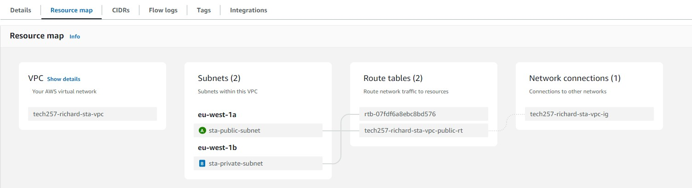

# AWS

## AWS Monitoring

- With your instance selected, find the **Monitoring** tab at the bottom section of the page.
- Click on **Monitoring** to view various CloudWatch metrics associated with your instance.
- For more granular monitoring, you can **enable detailed monitoring** for your EC2 instance. This will provide you with more detailed metrics every minute.

### Create a dashboard

From the instance's **Monitoring** tab:

- Add to dashboard.
- If we have enabled detailed monitoring, we can select _1 minute_ from the dropdown for each metric.


## Auto Scaling Groups


Use an ami (Amazon Machine Image) to scale new instances from. This way, you can ensure that all instances have the same configuration and software. They will also launch faster.

### Create an AMI:

1. Select the instance you want to create an AMI from.
2. **Actions** -> **Image and templates** -> **Create image**.
3. Enter a name and description for your AMI.
4. Adding a tag can add a name to the instance, e.g. _"Name", "ec2-instance"_.
5. **Create image**.

### Delete an AMI:

1. **Actions** -> **Deregister**.
2. **Actions** -> **Delete**.

When deleting an AMI, you will be asked if you want to delete the snapshots associated with the AMI. This is recommended as the snapshots store the data and are what cost money.

### Create a Launch template

We should create a **Launch template** to launch our ASG from. This is very similar to creating an AMI, but here are some things to note:

- Choose an AMI from MY AMIs. This should be the AMI you created in the previous step.
- **DO** select an instance type.
- **DO** add a key pair. This is important for SSH access to your instances.
- **DO NOT** select a subnet. This will be done in the Auto Scaling Group.
- Add very basic user data start the app:

```bash
#!/bin/bash

# The app is in root as the app was cloned with user data
cd /tech257-sparta-app/app

pm2 stop all

# Use pm2 to ensure app runs in the background
pm2 start app.js --name "sparta-test-app"
```

### Test the Launch template

Test the Launch template by creating a new instance from it: **Actions > Launch instance from template**. You can give this instance a name under Resource tags, e.g. _"Name"_, _"instance-from-lt"_.

### Create an Auto Scaling Group

Now we can create the Auto Scaling Group. AWS console breaks this into seven steps:

**Step 1**: Give it a name and associate the Launch template you created.

**Step 2**: We should choose different subnets in different availability zones.

**Step 3**:

- Attach a new load balancer.
- Load balancer type should be _Application Load Balancer_.
- Make it _internet-facing_.
- Create a new target group.
- _Default routing (forward to)_ the taget group.
- **Turn on Elastic Load Balancing health checks**.

**Step 4**:

- Set the desired capacity. 2 is a good starting point for high availability.
- Set the minimum capacity to 2.
- Set the maximum capacity.
- Check _Target tracking scaling policy_.
- Instance maintenance policy: _Prioritize availability_.

**Step 5**: Add a notification if required.

**Step 6**: Adding a tag here can name our instances, e.g. _"Name", "ec2-instance"_.

**Step 7**: Review and create the Auto Scaling Group.

### Test the Auto Scaling Group

To test the Auto Scaling Group, get the DNS name of the Load Balancer and navigate to it in your browser. You can find the DNS name in the Load Balancer section of the EC2 Dashboard, e.g. `tech257-richard-asg2-lb-1019814556.eu-west-1.elb.amazonaws.com`.

### Delete the Auto Scaling Group

To delete the Auto Scaling Group, we should also delete the load balancer and target group. Also, delete the Launch template if necessary.

## VPC

A Virtual Private Cloud (VPC) is a virtual network dedicated to your AWS account. It is logically isolated from other virtual networks in the AWS cloud. You can launch your AWS resources, such as Amazon EC2 instances, into your VPC.

### Create a VPC

1. Go to the VPC Dashboard.
2. Click **Create VPC**.
Choose VPC only.
3. Enter a name and CIDR block: 10.0.0.0/16.
4. Click **Create**.

### Create a subnet

1. Select the VPC you created.
One public and one private subnet is a good starting point.
Seperate availability zones is a good idea.
Public subnet CIDR block: 10.0.2.0/24. The gives us 256 IP addresses.
Private subnet CIDR block: 10.0.3.0/24

### Create an Internet Gateway

1. Create an internet gateway.
2. Attach the internet gateway to your VPC. Actions -> Attach to VPC.

### Create a route table

1. We only need a route table for the public subnet as AWS will create a default route table for the private subnet. The default route table (for the private subnet) will allow all the VPC's internal resources to communicate with each other.
2. Select the VPC in the dropdown.
3. Associate the subnet with the route table. **Edit subnet associations -> select the public subnet -> save**.
We only need to associate the public subnet with the route table as the private subnet will use the default route table. Therefore, **Subnet associations -> explicit subnet associations: public subnet**. **Subnets without explicit associations: private subnet**, which will use the default route table.
4. To link the public subnet to the internet gateway, we need to add a route to the route table. **Routes -> Edit route table -> add route -> destination: 0.0.0.0/0 -> target: internet gateway.** If we have properly associated the VPC with the internet gateway, it should appear in the dropdown.


_**Note**: Destination is a confusing term to me, but it is the destination of the traffic, not the destination of the route. The destination traffic from the internet to the instance's public IP address will be routed from the IGW to the instance._

### Create a security group

Add inbound and outbound rules to your security group. This should be done inside the VPC as security groups are VPC-specific.

### Check resource map

Can see this in **Your VPCs**. We should see the public subnet links to the route table we created **AND** the internet gateway. The private subnet should link to just the default route table. The public subnet in this example has a green circle with the Availability Zone, which means it is associated with the IGW. The private subnet has a blue sqaure for the Availability Zone, which means it is associated with the default route table.



### Launch an EC2 instance

Create the DB instance first as we need the private IP address for the app instance to connect to the DB instance.

In Network settings -> choose the VPC, the private subnet (for the DB) and the security group. We **DO NOT** need a public IP address for the DB instance so can Disable the auto-assign public IP.

For the app instance, choose the public subnet and the security group. We **DO** need a public IP address for the app instance.

Add a short user data script to the app instance to start the app. Be sure to change the IP address to the private IP address of the DB instance.

```bash
#!/bin/bash

export DB_HOST=mongodb://10.0.3.142:27017/posts

cd /tech257-sparta-app/app

pm2 stop all

# Use pm2 to start app and ensure it runs in the background
pm2 start app.js
```

### Delete a VPC

1. First delete instances running in the VPC.
2. Now we can delete the VPC. AWS will offer us the option to delete all the resources associated with the VPC (subnets, IGW, SG, Route table, etc.), which is a good idea.


## S3

S3 is a storage service provided by AWS. It is object-based storage, which means it stores data as objects. Each object consists of a file, data, and metadata. The data is stored in buckets, which are similar to folders.

For simplicity we can make an alias for python3:

`alias py=python3`

### Login to AWS CLI

```bash
aws configure

# List the configured profiles
aws configure list
```

### Create a bucket from CLI

```bash
# make bucket (mb)

aws s3 mb s3://tech257-richard-first-bucket

# list buckets (ls)

aws s3 ls s3://tech257-richard-first-bucket

# upload a file

aws s3 cp text.txt s3://tech257-richard-first-bucket

# download a file

aws s3 cp s3://tech257-richard-first-bucket/text.txt textdl.txt

# sync a directory

aws s3 sync s3://tech257-richard-first-bucket/text.txt

# delete a file (rm). Caution: this is permanent and without warning

:aws s3 rm s3://tech257-richard-first-bucket/text.txt:

aws s3 rm s3://tech257-richard-first-bucket --recursive

# delete a bucket

aws s3 rb s3://tech257-richard-first-bucket
```

: aws s3 rm s3://tech257-richard-first-bucket/text.txt :

:boom: aws s3 rm s3://tech257-richard-first-bucket/text.txt :boom:

### Using boto3

#### Create a bucket

```python
import boto3

region = 'eu-west-1'

s3_client = boto3.client('s3', region_name=region)
location = {'LocationConstraint': region}
s3_client.create_bucket(Bucket='tech257-richard-bucket', CreateBucketConfiguration=location)
```

#### Delete a bucket

```python
import boto3

# Function to delete all objects in a bucket
def empty_bucket(bucket_name):
    s3 = boto3.resource('s3')
    bucket = s3.Bucket(bucket_name)
    
    # Now delete all objects in the bucket
    bucket.objects.all().delete()

# Function to delete a bucket
def delete_bucket(bucket_name):
    try:
        s3_client = boto3.client('s3')
        # First empty the bucket
        empty_bucket(bucket_name)
        # Then delete the bucket
        s3_client.delete_bucket(Bucket=bucket_name)
        print(f"Bucket '{bucket_name}' deleted successfully.")
    except boto3.exceptions.Boto3Error as e:
        print(f"Error: {e}")

bucket_name = 'tech257-richard-bucket'
delete_bucket(bucket_name)
```

#### Upload a file

```python
import boto3

region = 'eu-west-1'

s3_client = boto3.client('s3', region_name=region)

s3_client.delete_object(Bucket='tech257-richard-bucket', Key='text.txt')
```

#### Download a file

```python
import boto3

region = 'eu-west-1'

s3_client = boto3.client('s3', region_name=region)

s3_client.download_file('tech257-richard-bucket', 'text.txt', 'textdl.txt')
```

#### List buckets

```python
import boto3

region = 'eu-west-1'

s3_client = boto3.client('s3', region_name=region)

# Call the list_buckets method to retrieve the buckets
response = s3_client.list_buckets()

# Response contains a Buckets key that is a list of bucket dictionaries
print("List of S3 Buckets:")
for bucket in response['Buckets']:
    print(f"- {bucket['Name']}")
```

#### Upload a file

```python
import boto3

region = 'eu-west-1'

s3_client = boto3.client('s3', region_name=region)

s3_client.upload_file('/home/ubuntu/text.txt', 'tech257-richard-bucket', 'text.txt')
```

## Alarms


### Create an alarm

1. Go to the CloudWatch dashboard.
2. Click **Alarms** -> **Create alarm**.
3. Choose a metric, e.g. EC2 -> Per-Instance Metrics -> CPUUtilization.
4. Choose the instance you want to monitor.
5. Set the threshold, e.g. 70%.
6. Set the period, e.g. 1 minute.
7. Set the evaluation period, e.g. 2 minutes.
8. Set the action, e.g. **Create a new topic**.
9. Set the notification, e.g. **Email**.
10. Click **Create alarm**.

### Create an SNS topic

1. Go to the SNS dashboard.
2. Click **Topics** -> **Create topic**.
3. Enter a name and display name.
4. Click **Create topic**.
5. Click **Create subscription**.
6. Choose the protocol, e.g. **Email**.
7. Enter the endpoint, e.g. your email address.
8. Click **Create subscription**.

### Test the alarm

```bash
sudo apt-get install apache2-utils -y

# Send 1000 requests with 100 concurrent requests

ab -n 1000 -c 100 http://3.254.167.171/ | grep "Requests per second"

# Send 10000 requests with 200 concurrent requests

ab -n 10000 -c 200 http://3.254.167.171/
```