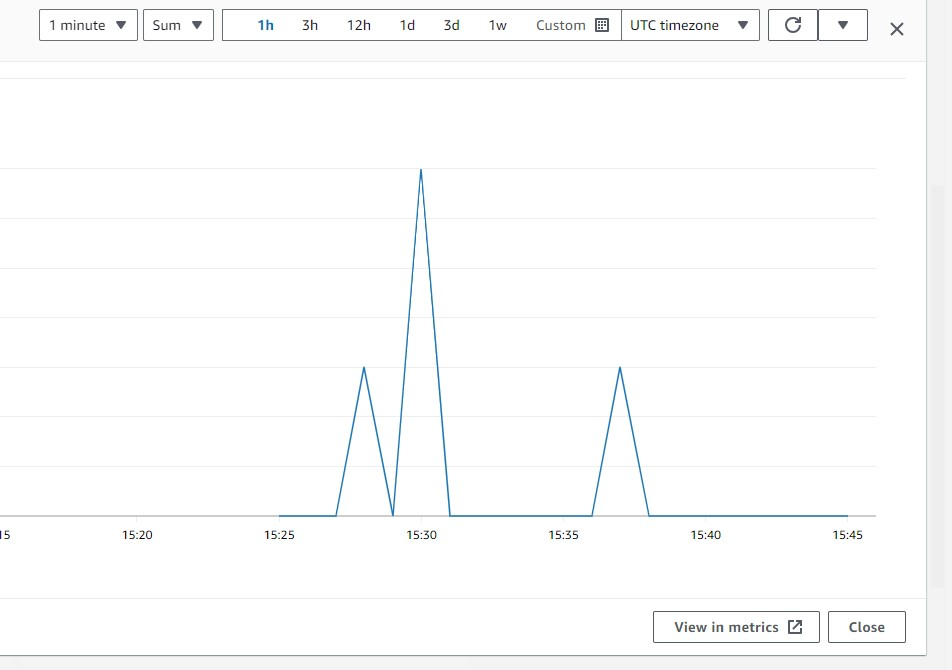

# AWS

## AWS Monitoring

- With your instance selected, find the **Monitoring** tab at the bottom section of the page.
- Click on **Monitoring** to view various CloudWatch metrics associated with your instance.
- For more granular monitoring, you can **enable detailed monitoring** for your EC2 instance. This will provide you with more detailed metrics every minute.

### Create a dashboard

From the instance's **Monitoring** tab:

- Add to dashboard.
- If we have enabled detailed monitoring, we can select _1 minute_ from the dropdown for each metric.



## Auto Scaling Groups

Use an ami (Amazon Machine Image) to scale new instances from. This way, you can ensure that all instances have the same configuration and software. They will launch faster.

To create an AMI:

1. Select the instance you want to create an AMI from.
2. **Actions** -> **Image and templates** -> **Create image**.
3. Enter a name and description for your AMI.
4. Add a tag can add a name to the instance, e.g. "Name", "ec2-instance".
5. **Create image**.

### Create a Launch template

First we need to create a **Launch template**. This is very similar to creating an AMI, but here are some things to note:

- Choose an AMI from MY AMIs. This should be the AMI you created in the previous step.
- **DO** select an instance type.
- **DO** add a key pair. This is important for SSH access to your instances.
- **DO NOT** select a subnet. This will be done in the Auto Scaling Group.
- Add very basic user data start the app.

User data:

```bash
#!/bin/bash

# The app is in root as the app was cloned with user data
cd /tech257-sparta-app/app

pm2 stop all

# Use pm2 to ensure app runs in the background
pm2 start app.js --name "sparta-test-app"
```

### Test the Launch template

Test the Launch template by creating a new instance from it: **Actions > Launch instance from template**. You can give this instance a name under Resource tags, e.g. _"Name"_, _"instance-from-lt"_.

### Create an Auto Scaling Group

Now we can create the Auto Scaling Group. AWS console breaks this into seven steps:

**Step 1**: Give it a name and associate the Launch template you created.

**Step 2**: We should choose different subnets in different availability zones.

**Step 3**:

- Attach a new load balancer.
- Load balancer type should be _Application Load Balancer_.
- Make it _internet-facing_.
- Create a new target group.
- Default routing forward to the taget group.
- Turn on Elastic Load Balancing health checks.

**Step 4**:

- Set the desired capacity. 2 is a good starting point for high availability.
- Set the minimum capacity to 2.
- Set the maximum capacity.
- Check _Target tracking scaling policy_.
- Instance maintenance policy: _Prioritize availability_.

**Step 5**: Add a notification if required.

**Step 6**: Adding a tag here can name our instances, e.g. _"Name", "ec2-instance"_.

**Step 7**: Review and create the Auto Scaling Group.

### Test the Auto Scaling Group

To test the Auto Scaling Group, get the DNS name of the Load Balancer and navigate to it in your browser. You can find the DNS name in the Load Balancer section of the EC2 Dashboard, e.g. `tech257-richard-asg2-lb-1019814556.eu-west-1.elb.amazonaws.com`.

### Delete the Auto Scaling Group

To delete the Auto Scaling Group, we should also delete the load balancer and target group. Also, delete the Launch template if necessary.
