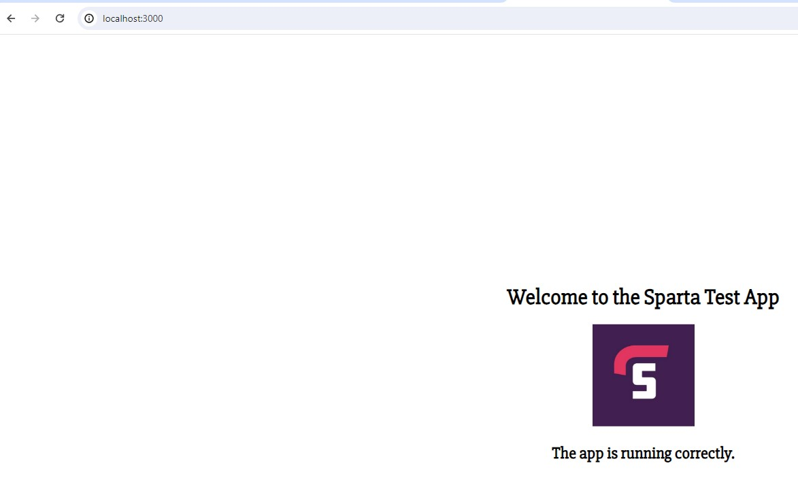

# Docker

## Docker Installation

### Ubuntu

```bash
sudo apt-get update

sudo apt-get install apt-transport-https ca-certificates curl software-properties-common

curl -fsSL https://download.docker.com/linux/ubuntu/gpg | sudo apt-key add -

sudo add-apt-repository "deb [arch=amd64] https://download.docker.com/linux/ubuntu $(lsb_release -cs) stable"

sudo apt-get update

sudo apt-get install docker-ce
```
### Update Docker

```bash
sudo apt-get update

sudo apt-get install docker-ce
```

### Docker cmds

```bash
# -d is for detached mode. This will run the container in the background. -p is for port mapping. 8080 is the host port and 80 is the container port.

docker run -d -p 8080:80 nginx

# enter the container (it has to be running)
docker exec -it 48dbc099f4d6 sh

# save a container as an image
docker commit 48dbc099f4d6 followcrom/nginx-custom:v3

# push an image to docker hub
docker push followcrom/nginx-custom:v3

# test it
docker run -d -p 8080:80 followcrom/nginx-custom:v3

# remove docker image
docker rmi followcrom/nginx-custom:v2

# docker stop all containers
docker stop $(docker ps -a -q)

# docker remove all containers
docker rm $(docker ps -a -q)
```

### Northwind app as Docker container

```bash
# Use an official Python runtime as a parent image
FROM python:3.9-slim

# Set the working directory in the container
WORKDIR /app

# Copy the current directory contents into the container at /app
COPY . /app

# Install any needed packages specified in requirements.txt
RUN pip install --no-cache-dir -r requirements.txt

# Make port 5000 available to the world outside this container
EXPOSE 5000

ENV FLASK_APP=northwind_web.py

# Run app.py when the container launches
CMD [ "waitress-serve", "--port=5000", "northwind_web:app"]
```


## Kubernetes



# Command to build a Docker image with tag 'v1'
docker build -t sta:v1 .

docker run -d -p 3000:3000 slsta:v1

# commit the image

docker commit af2c6b7c24a2 followcrom/sta:v1

# push the image to Docker Hub

docker push followcrom/sta:v1

# test the image

docker run -d -p 3000:3000 followcrom/sta:v1

docker run -d -p 3030:3000 spencerley/spencer-sparta-test-app
