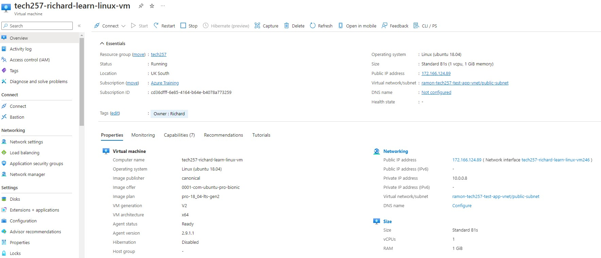
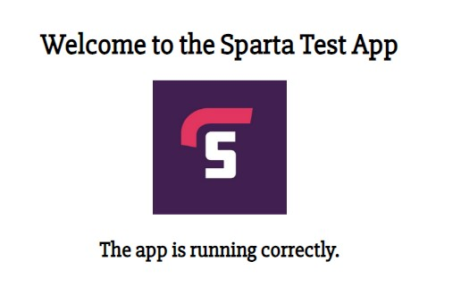
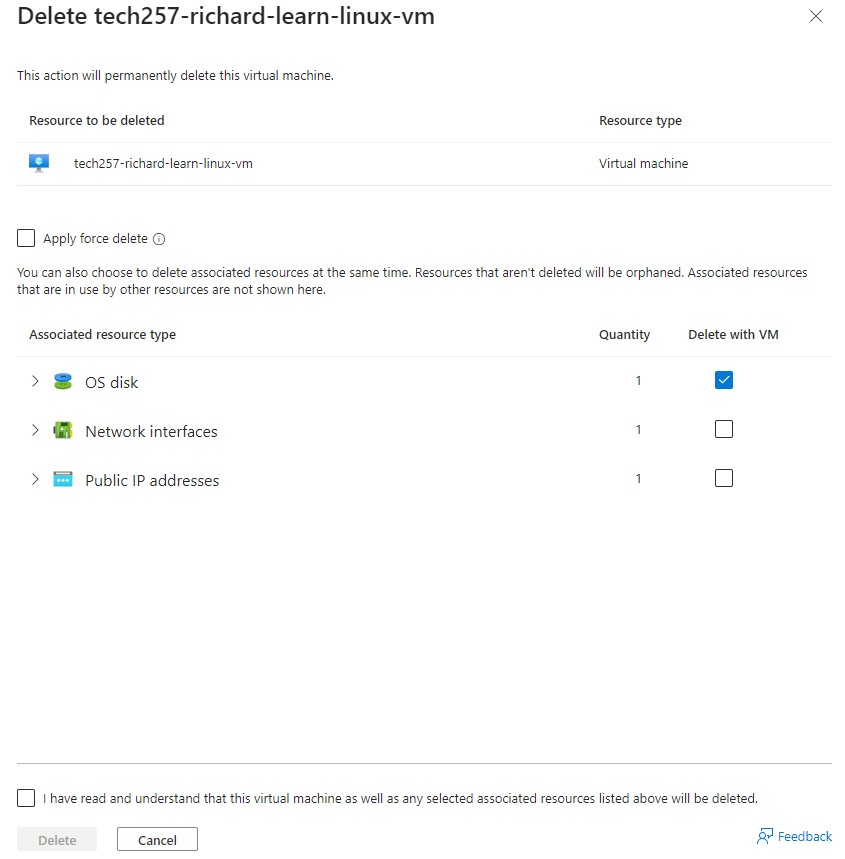

## Creating a VM on Azure

- **Step 1: Create a New Virtual Machine**
  - On the Azure dashboard, select "Virtual machines".
  - Alternatively, you can search for "Virtual machines" in the search bar.
  - On the "Virtual machines" page, click _Create > Azure virtual machine_. You will be taken through to options to configure the VM.

- **Step 2: Configure Settings**
  - **Subscription**: Choose the _Azure Training_ subscription.
  - **Resource Group**: Choose _tech257_ as the resource group.
  - **Virtual Machine Name**: Enter a name for your VM.
  - **Region**: Select _UK South_ for the Azure region to deploy the VM.
  - **Availability Options**: At this stage, _No infrastructure redundancy required_.
  - **Security**: _Standard_
  - **Image**: Choose the OS image: _Ubuntu Pro 22.04 LTS - Gen2_.
  - **Size**: Choose the VM size based on your performance and cost requirements. In this case _Standard_B1s - 1 vcpu, 1GiB_.

- **Step 3: Administrator Account**
  - Set user name to _adminuser_.
  - We'll use an SSH public key for authentication: an existing public key has already been added to the account.

- **Step 4: Inbound Port Rules**
  - We'll allow port 22 for SSH connections and port 80 for those over HTTP. We can add port 3000 for the app later.

- **Step 5: Disks**
  - We'll use the _Standard SSD_ for the OS disk.
  - Check _Delete with VM_.

- **Step 6: Network Settings**
  - Select a Virtual Network. In this case: _tech257-richard-2subnet-vnet_.
  - Subnet: _public_.
  - NIC network security group: _tech257-richard-vm-from-image-nsg_ (expose ports 22, 80 and 3000).

- **Step 7: Tags**
  - Define a key-value pair for the resource: _Owner: Richard_.

- **Step 8: Review and Create**
  - Review all settings, and then click "Create" to deploy your VM.

Deployment may take a few minutes. Once complete, you can view the VM on the Azure portal, as below:



## Make an Image of a VM

Before deallocating the VM, run the following command in the VM's terminal:

`sudo waagent -deprovision+user`

This command removes the user-specific data from the VM, preparing it for being captured as an image.

Ensure you have Azure CLI installed. Then, run the following commands in a local terminal:

Deprovisioning is the process of removing user-specific data from the VM to prepare it for being captured as an image.

`az vm deallocate --resource-group tech257 --name <VM_name>`

Deallocating a VM stops the VM and releases the compute resources it was using. This is necessary before capturing an image.

`az vm generalize --resource-group tech257 --name <VM_name>`

Generalizing a VM removes all user-specific information from the VM, including the SSH keys and the user account.

From the Azure portal, navigate to the VM's overview page and click on "Capture".

## Create a new VM from an image

Select the image to clone. Create a VM using as the image, the other steps are as above.

In the advanced tab, we should add our launch script as user data. This will be run when the VM is first started.

## User Data

User data is a script that runs when a VM is first started. This method is used to automate the setup process, including installing software, applying configurations, or running scripts without manual intervention immediately after the VM boots for the first time.

**Note**: When using user data or custom data scripts for VM initialization in cloud environments like Azure, the process is generally "fire-and-forget," meaning that the script is executed without interactive feedback.

**Note**: We need to update the Nginx configuration to proxy requests to the app. First, we'll back up the default configuration file, then update it to proxy requests to the app running on port 3000.

```bash
#!/bin/bash

# Update package lists
sudo apt update -y

# Upgrade packages non-interactively, and automatically handle prompts
sudo DEBIAN_FRONTEND=noninteractive apt-get upgrade -y

# Install Nginx
sudo apt install nginx -y

# Restart and enable Nginx to run on startup
sudo systemctl restart nginx
sudo systemctl enable nginx

# Install Node.js 20.x (this also installs npm as a dependency)
curl -fsSL https://deb.nodesource.com/setup_20.x | sudo -E bash -

sudo apt install nodejs

# Install pm2 globally
sudo npm install pm2 -g

# Clone the app from GitHub
git clone https://github.com/followcrom/tech257-sparta-app.git

# Navigate to the app directory
cd tech257-sparta-app/app

# Install dependencies
npm install

NGINX_CONF_PATH="/etc/nginx/sites-available"

cd $NGINX_CONF_PATH

NGINX_CONF="default"

# OK in user data but not for multiple runs
sudo cp $NGINX_CONF "${NGINX_CONF}.backup"

# Display the full path of the Nginx configuration file being edited
echo "Updating Nginx configuration in: $NGINX_CONF_PATH/$NGINX_CONF"

sudo sed -i 's|try_files $uri $uri/ =404;|proxy_pass http://localhost:3000/;|' $NGINX_CONF

sudo systemctl restart nginx

cd -

pm2 stop all

# Use pm2 to start app and ensure it runs in the background
pm2 start app.js --name "sparta-test-app"
```

## Run Script on new Image

As the new image is a copy of the original VM, it already has the **nginx server** installed and node modules, so we can trim our deploy script a little.

**Note** As we are creating the new VM from an image built for the one we buit with user Data, the app itself is in a different directory: **/repo/app**.

Here is the reduced User Data:

```bash
#!/bin/bash

# Navigate to the app directory
cd repo/app/

echo "Current directory: $(pwd)"

if pm2 list | grep -q "online"; then
    pm2 stop all
    echo "Stopped all running processes."
else
    echo "No running processes found."
fi

# Use pm2 to start app and ensure it runs in the background
pm2 start app.js --name "sparta-test-app"
```

Then we check the app is running by navigating to the public IP address of the VM in a web browser.



## Deleting a VM on Azure

  - On the "Virtual machines" page from the Azure portal dashboard, find and select the VM you wish to delete.
  - On the VM's overview page, click on the "Delete" button.
  - You may be asked to confirm the deletion. Confirm by typing the name of the VM or following the prompt instructions.

**Delete Associated Resources (Optional)**

When deleting a VM, consider if you also want to delete associated resources like disk storage, network interfaces, or public IP addresses. These resources are billed separately and won't be automatically deleted with the VM.

**Verify Deletion**

After deletion, ensure that the VM and any selected associated resources no longer appear in their respective sections within the Azure portal.

**Important Notes**:
- Deleting a VM is irreversible. Ensure you have backed up any necessary data before proceeding.
- Remember that deleting the VM does not automatically delete associated resources like disks or network interfaces, which might incur charges if left undeleted.

