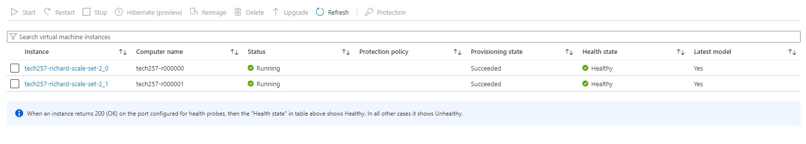

## Monitoring and Responding to Load/Traffic

When it comes to monitoring and responding to load/traffic, there are different levels of effectiveness. Here is a ranking from worst to best:

1. **No Monitoring**: This is the worst scenario where there is no monitoring in place. It leaves you blind to any issues or potential bottlenecks, making it difficult to respond effectively.

2. **Reactive Monitoring**: In this approach, monitoring is done after an issue or incident occurs. While it allows you to react to problems, it lacks proactive measures to prevent them from happening in the first place.

3. **Threshold-based Monitoring**: This involves setting predefined thresholds for various metrics such as CPU usage, memory utilization, or network traffic. When these thresholds are exceeded, alerts are triggered. While it provides some level of proactive monitoring, it may not capture all potential issues.

4. **Auto Scaling**: This is the most advanced level of monitoring, proactively scaling and optimizing based on demand.

## Setting up a Dashboard

To set up a monitoring dashboard, follow these steps:

1. From the VM Overview, monitor the CPU, Memory, Disk, and Network usage.

2. Pin any metric you want to monitor to the dashboard. Share the dashboard and give it a name.

3. Go to the dashboard on Azure portal.

4. Design your dashboard layout and choose the appropriate visualizations for each metric.

## Combination of Load Testing and Dashboard

By combining load testing and a monitoring dashboard, you can gain valuable insights into your system's performance and make informed decisions. Here's how it can help:

1. Load Testing: Conducting load tests allows you to simulate various traffic scenarios and measure the system's response under different loads. This helps identify performance bottlenecks, scalability issues, and potential areas of improvement.

2. Monitoring Dashboard: The monitoring dashboard provides real-time visibility into the system's performance metrics during load testing. It allows you to monitor key indicators, track resource utilization, and identify any anomalies or deviations from expected behavior.

We can make concurrent requests to the server and monitor the CPU, Memory, Disk, and Network usage in real-time. This helps us understand how the system responds to increased load and identify any performance issues or bottlenecks.

```bash
sudo apt-get install apache2-utils -y

# Send 1000 requests with 100 concurrent requests

ab -n 1000 -c 100 http://172.166.126.211/ | grep "Requests per second"

ab -n 1000 -c 100 http://172.166.126.211/

# Send 10000 requests with 200 concurrent requests

ab -n 10000 -c 200 http://172.166.126.211/
```

Visualizing the CPU usage during load testing:


# Setting up CPU Usage Alert on Azure

1. From the VM Overview -> Monitor -> Create Alert Rule

2. Select condition (e.g. Metric -> CPU Usage)

3. Define the Alert Logic. For example, set the threshold value for the CPU usage that will trigger the alert.

4. Assign an action group which sends an email notification to a user when the alert is triggered.

5. Review and create the alert rule.

**Email Alert:**

!

**Alert Fired:**

!

# Auto Scaling

## Creating an Azure VM Scale Set

1. Navigate to the Azure portal and "Virtual Machine Scale Set".

2. Select the image to use for the VM Scale Set.

3. In the Networking tab, select the virtual network and subnet for the VM Scale Set.

4. Select Azure load balancer, ensuring it is public. The inbound NAT pool should be set to 50000-50100 for SSH and 80 for HTTP.

5. Define the scaling options, such as the minimum and maximum number of instances and the scale in/out criteria.

6. In the advanced tab, add a simple bash script as user data:
    
```bash
#!/bin/bash

cd tech257-sparta-app/app/

pm2 stop all

pm2 start app.js
```

7. On the Health Probe tab:
- Enable application health monitoring on port 80.
- Enable automatic repairs, so unhealthy instances are deleted and new ones automatically created from the image.
- Set a Grace period of 10 minutes. After 10 minutes, if the instance is still unhealthy, it will be deleted and replaced.



After stopping and restarting a scale set, **reimagine** all instances to ensure the application is running again. Simply restarting an instance means  any dynamic or runtime-specific aspects won't be included.

**Auto-scaling:**


## Load Balancer and its Importance

A load balancer is a networking device that distributes incoming network traffic across multiple virtual machines. It helps improve the availability and scalability of applications by evenly distributing the workload.

A load balancer ensures that if one vm fails, the traffic is automatically redirected to the remaining vm, minimizing downtime.

Load balancers can act as a single entry point for incoming traffic, providing an additional layer of security by filtering and inspecting requests before forwarding them to the vms.

## Create an unhealthy instance

Stop and start one of the scale set's instances. This will start the instance without restarting the application, resulting in a 502 bad gateway error.


If the instance is unhealthy for longer than the grace period, the load balancer will automatically delete it and create a new one from the image.


## SSH into an instance

In the terminal, run the following command to SSH into an instance:

```bash
ssh -i ~/.ssh/richard-az-key -p 50000 azureuser@<lb-ip-address>
```

Increment the port number by 1 for each instance (starts at 50000 because the NAT pool is set from 50000).

## Delete a VM Scale Set

We need to delete four elements to delete a VM Scale Set:

- Scale set
- Load balancer
- Public IP address
- Network security group

Deleting them in the above order is recommended.

# 3-Subnet Architecture

**Network virtual appliances (NVAs)** are virtual appliances that perform network functions such as routing, firewalling, and VPNs. They can be used to secure and optimize traffic between virtual machines in Azure.

We can create a VNET with three subnets:

    -private

    -public

    -DMZ (demilitarized zone)

Assign the following IP addresses to the subnets:

    - private: 10.0.2.0/24
    - public: 10.0.3.0/24
    - DMZ: 10.0.4.0/24

Then we can create our VMs. We'll start with the DB VM as we'll need that VM's private IP address to configure the App VM.

Create the three VMs, using images where possible and minimal user data where necessary.  Add the DM VM's private IP address to the App VM's environment variables as part of the user data.

```bash
#!/bin/bash

export DB_HOST=mongodb://10.0.4.4:27017/posts

# Navigate to the app directory from user data
cd tech257-sparta-app/app/

pm2 stop all

# Use pm2 to start app and ensure it runs in the background
pm2 start app.js
```

Ping the DB VM's private IP address from the APP VM to check they are talking to each.

```bash
ping 10.0.4.4
```

Enable IP forwarding on the NVA to allow it to forward traffic between the subnets. The first step is to do this on the console. Then SSH into the NVA VM and check if the NVA is forwarding traffic between the subnets.

```bash
sudo sysctl net.ipv4.ip_forward
```

This is the file to edit to enable IP forwarding:

```bash
sudo nano /etc/sysctl.conf
```

Uncomment the following line:

```bash
net.ipv4.ip_forward=1
```

To apply the changes, run the following command:
```bash
sudo sysctl -p
```

Or for simplicity, run:

```bash
sudo sysctl -w net.ipv4.ip_forward=1
```

But this is allowing ALL traffic to be forwarded. To restrict it to only the subnets, we need to add **iptables rules**.

Create a file in the home directory called `config-ip-tables.sh` (`sudo nano config-ip-tables.sh`) and add the following content to it:

```bash
#!/bin/bash
 
# configure iptables
 
echo "Configuring iptables..."
 
# ADD COMMENT ABOUT WHAT THE FOLLOWING COMMAND(S) DO
sudo iptables -A INPUT -i lo -j ACCEPT
sudo iptables -A OUTPUT -o lo -j ACCEPT

# The above comands allow traffic on the loopback interface. That means that the traffic is allowed to go from the VM to itself and vice versa.

# ADD COMMENT ABOUT WHAT THE FOLLOWING COMMAND(S) DO
sudo iptables -A INPUT -m state --state ESTABLISHED,RELATED -j ACCEPT

# The above comands allow traffic that is part of an established connection or related to an established connection. This is important because it allows the VM to receive responses to the requests it sends out.

# ADD COMMENT ABOUT WHAT THE FOLLOWING COMMAND(S) DO
sudo iptables -A OUTPUT -m state --state ESTABLISHED -j ACCEPT
 
# ADD COMMENT ABOUT WHAT THE FOLLOWING COMMAND(S) DO
sudo iptables -A INPUT -m state --state INVALID -j DROP
 
# ADD COMMENT ABOUT WHAT THE FOLLOWING COMMAND(S) DO
sudo iptables -A INPUT -p tcp --dport 22 -m state --state NEW,ESTABLISHED -j ACCEPT
sudo iptables -A OUTPUT -p tcp --sport 22 -m state --state ESTABLISHED -j ACCEPT
 
# uncomment the following lines if want allow SSH into NVA only through the public subnet (app VM as a jumpbox)
# this must be done once the NVA's public IP address is removed
#sudo iptables -A INPUT -p tcp -s 10.0.2.0/24 --dport 22 -m state --state NEW,ESTABLISHED -j ACCEPT
#sudo iptables -A OUTPUT -p tcp --sport 22 -m state --state ESTABLISHED -j ACCEPT
 
# uncomment the following lines if want allow SSH to other servers using the NVA as a jumpbox
# if need to make outgoing SSH connections with other servers from NVA
#sudo iptables -A OUTPUT -p tcp --dport 22 -m conntrack --ctstate NEW,ESTABLISHED -j ACCEPT
#sudo iptables -A INPUT -p tcp --sport 22 -m conntrack --ctstate ESTABLISHED -j ACCEPT
 
# ADD COMMENT ABOUT WHAT THE FOLLOWING COMMAND(S) DO
sudo iptables -A FORWARD -p tcp -s 10.0.2.0/24 -d 10.0.4.0/24 --destination-port 27017 -m tcp -j ACCEPT
 
# ADD COMMENT ABOUT WHAT THE FOLLOWING COMMAND(S) DO
sudo iptables -A FORWARD -p icmp -s 10.0.2.0/24 -d 10.0.4.0/24 -m state --state NEW,ESTABLISHED -j ACCEPT
 
# ADD COMMENT ABOUT WHAT THE FOLLOWING COMMAND(S) DO
sudo iptables -P INPUT DROP
 
# ADD COMMENT ABOUT WHAT THE FOLLOWING COMMAND(S) DO
sudo iptables -P FORWARD DROP
 
echo "Done!"
echo ""
 
# make iptables rules persistent
# it will ask for user input by default
 
echo "Make iptables rules persistent..."
sudo DEBIAN_FRONTEND=noninteractive apt install iptables-persistent -y
echo "Done!"
echo ""
```

Test the rules by pinging the DB VM from the App VM. If the ping is successful, the rules are working. Now, the NVA is only forwarding traffic between the subnets.
